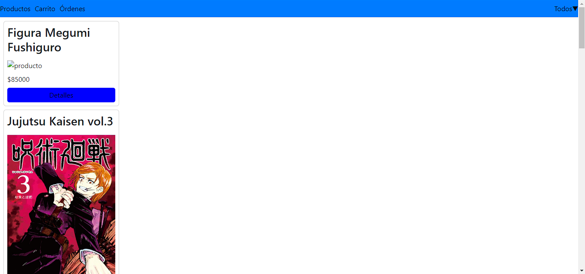
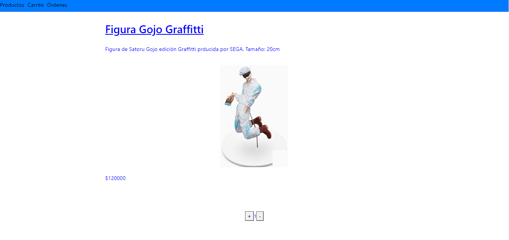
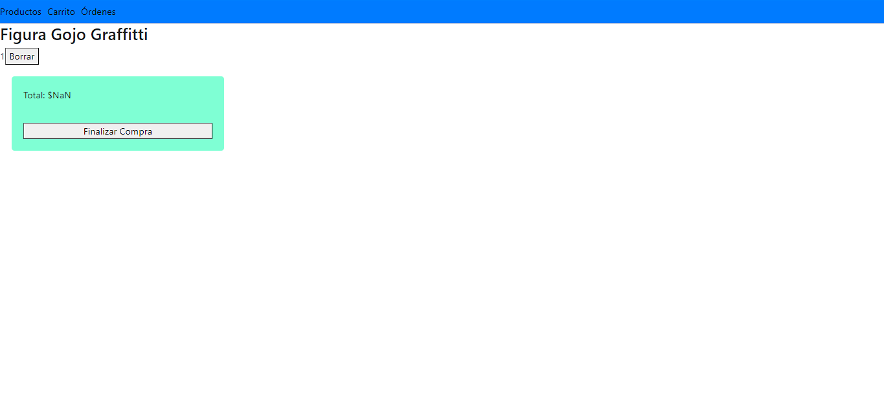
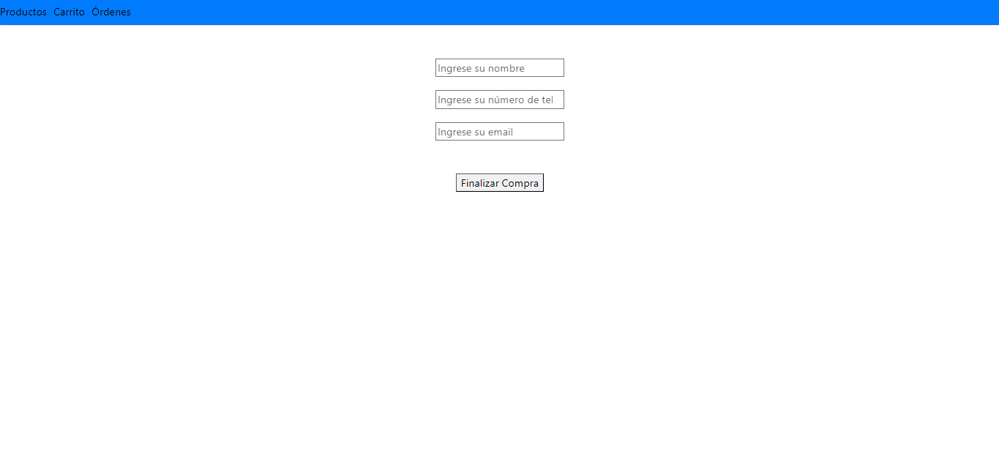
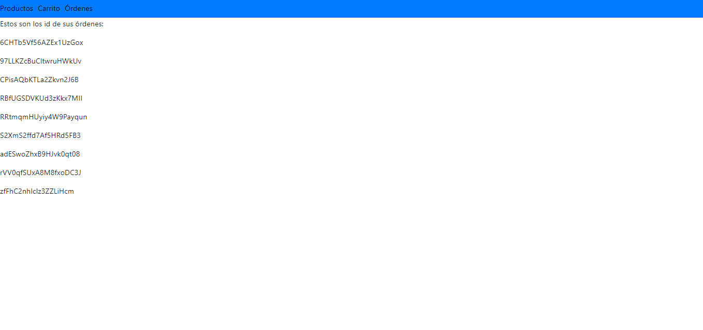

# Mahoraga Store - Proyecto Curso React

## Funciones Principales
- Compra de Merch, Mangas y Figuras
- Control de stock
- Creación de Ordenes
### Home
Permite ver los productos disponibles e ingresar al detalle de cada uno

### Detalle del producto
Permite ver imágen, descripción y precio de los productos, además de ofrecer la oportunidad de agregarlos al carrito

### Cart
Permite ver los items en el carrito y comenzar la orden

### Checkout
Obtiene datos del comprador, genera la orden y presenta el id de la orden  al comprador

### Órdenes
Permite ver los id de las órdenes hechas por el comprador

## Tecnologías Utilizadas
- React router dom para la navegación
- imgbb para hostear las imágenes de los productos
- Google Firebase para simular el back end
- Font Awesome para el Loader